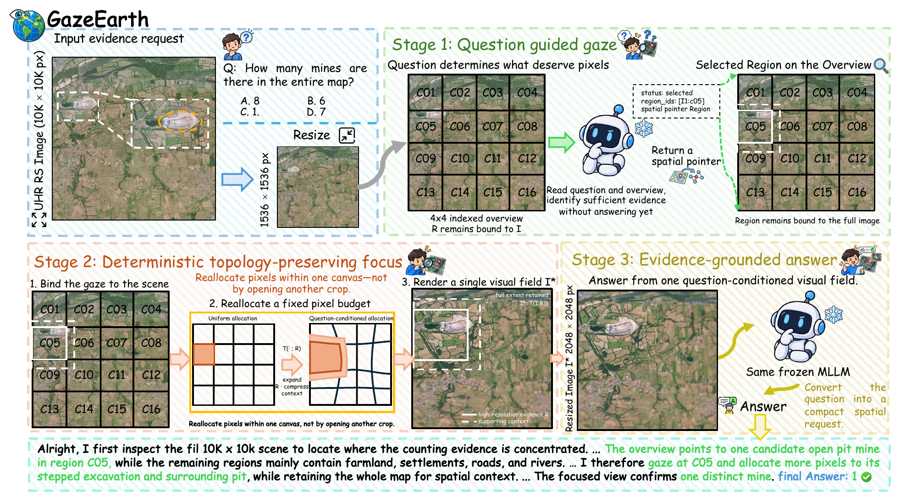

<h1 align="center">
  
  The Earth in One Gaze: Training-Free<br>
  Active Focus for UHR Remote Sensing Understanding
</h1>

<p align="center">
  <strong><em>
    Yao Zhang<sup>1,*</sup>, Pengyu Dai<sup>2,3,*</sup>, Wei Guo<sup>1,†</sup>, Jian Liang<sup>1</sup>,<br>
    Jian Song<sup>3</sup>, Yafei Ou<sup>3</sup>, Hongruixuan Chen<sup>3,†</sup>, Naoto Yokoya<sup>2,3</sup>
  </em></strong>
</p>

<p align="center">
  <sup>1</sup> Wuhan University &nbsp; <sup>2</sup> The University of Tokyo &nbsp; <sup>3</sup> RIKEN AIP<br>
  <sup>*</sup> Equal contribution &nbsp; <sup>†</sup> Corresponding authors
</p>

<p align="center">
  <a href="https://arxiv.org/abs/2609.31747"></a>
  <a href="https://zhangyyy-ai-rs.github.io/GazeEarth/"></a>
  <a href="https://huggingface.co/Yao0317/GazeEarth"></a>
  <a href="LICENSE"></a>
</p>

## Abstract

<p align="justify">
Multimodal large language models must balance local detail against scene context when interpreting ultra-high-resolution remote-sensing imagery within a limited visual-input budget. Knowing where to look is not enough: what a model can infer from selected evidence also depends on how that evidence is presented. We introduce <strong>GazeEarth</strong>, a training-free framework that couples question-guided region selection with full-scene foveated observation. A frozen model selects evidence cells from an indexed overview. A deterministic, topology-preserving warp then resamples the original image onto a fixed-size canvas, enlarging the selected neighborhood while compressing the periphery. The same model answers from this focused view, retaining local evidence within its surrounding scene context. GazeEarth requires at most two model calls, with no fine-tuning, external selector, or iterative search.
</p>

<p align="center">
  <a href="figure/framework.png"></a>
</p>

##  Environment

<p align="justify">Python <strong>3.11</strong> and a CUDA GPU are recommended. Run the following commands from the repository root:</p>

```bash
conda create -n gazeearth python=3.11 -y
conda activate gazeearth

pip install torch==2.6.0 torchvision==0.21.0 --index-url https://download.pytorch.org/whl/cu124
pip install -r requirements.txt
pip install -e . --no-deps
python -m nltk.downloader wordnet omw-1.4
```

##  Data

<p align="justify">Arrange <a href="https://huggingface.co/datasets/HappyBug/LRS-GRO">LRS-GRO</a>, <a href="https://huggingface.co/datasets/initiacms/XLRS-Bench-lite">XLRS-Bench</a>, and <a href="https://huggingface.co/datasets/yifanzhang114/MME-RealWorld">MME-RealWorld-RS</a> as follows:</p>

```text
data/
├── LRS-GRO/
│   ├── test.json
│   └── images/
│       └── ...
├── XLRS-Bench/
│   ├── test.jsonl
│   └── images/
│       └── ...
└── MME-RealWorld-RS/
    ├── test.jsonl
    └── images/
        └── ...
```

<p align="justify">For custom paths, update <code>dataset.annotation_path</code> and <code>dataset.root</code> in the YAML config.</p>

##  Backbone Configuration

<p align="justify">Use the default Qwen3-VL configuration, or add a model configuration to either inference or evaluation:</p>

| Backbone | Model configuration |
| :--- | :--- |
| [Qwen3-VL-8B-Instruct](https://huggingface.co/Qwen/Qwen3-VL-8B-Instruct) | Default in the benchmark configs |
| [LLaVA-v1.6-Mistral-7B](https://huggingface.co/llava-hf/llava-v1.6-mistral-7b-hf) | `--model-config configs/llava.yaml` |
| [Intern-S1-mini](https://huggingface.co/internlm/Intern-S1-mini) | `--model-config configs/intern_s1.yaml` |
| [GPT-4o via OpenRouter](https://openrouter.ai/openai/gpt-4o-2024-11-20) | `--model-config configs/gpt4o.yaml` |

<p align="justify">For GPT-4o, set the <code>OPENROUTER_API_KEY</code> environment variable before running. API usage is billed by the provider.</p>

##  Evaluation

```bash
# Evaluate a benchmark.
python scripts/eval.py --config configs/xlrs_bench.yaml --output outputs/xlrs_qwen
python scripts/eval.py --config configs/lrs_gro.yaml
python scripts/eval.py --config configs/mme_realworld_rs.yaml

# For the same command and output directory:
#   append --resume to continue an interrupted run;
#   append --overwrite to back up existing outputs and restart.

# Ask a question about your own image.
python scripts/infer.py --images path/to/image.jpg --question "What is shown?"
```

<p align="justify">Outputs include <code>predictions.jsonl</code>, <code>traces.jsonl</code>, <code>results.json</code>, and <code>run_manifest.json</code>. Do not combine <code>--resume</code> and <code>--overwrite</code>.</p>

##  Citation

If you find GazeEarth useful in your research, please consider citing our paper:

```bibtex
@misc{zhang2026gazeearth,
  title         = {The Earth in One Gaze: Training-Free Active Focus for {UHR} Remote Sensing Understanding},
  author        = {Yao Zhang and Pengyu Dai and Wei Guo and Jian Liang and Jian Song and Yafei Ou and Hongruixuan Chen and Naoto Yokoya},
  year          = {2026},
  eprint        = {2609.31747},
  archivePrefix = {arXiv},
  primaryClass  = {cs.CV},
  url           = {https://arxiv.org/abs/2609.31747}
}
```

##  Acknowledgements

<p align="justify">We thank the teams behind <a href="https://huggingface.co/Qwen/Qwen3-VL-8B-Instruct">Qwen3-VL</a>, <a href="https://huggingface.co/llava-hf/llava-v1.6-mistral-7b-hf">LLaVA</a>, <a href="https://huggingface.co/internlm/Intern-S1-mini">Intern-S1</a>, and <a href="https://openrouter.ai/openai/gpt-4o-2024-11-20">GPT-4o</a> for making their models accessible, and the creators of <a href="https://huggingface.co/datasets/HappyBug/LRS-GRO">LRS-GRO</a>, <a href="https://huggingface.co/datasets/initiacms/XLRS-Bench-lite">XLRS-Bench</a>, and <a href="https://huggingface.co/datasets/yifanzhang114/MME-RealWorld">MME-RealWorld</a> for providing the benchmarks used in this work.</p>
